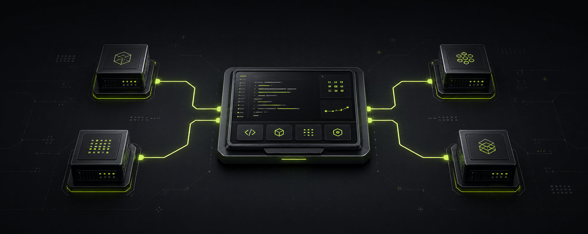
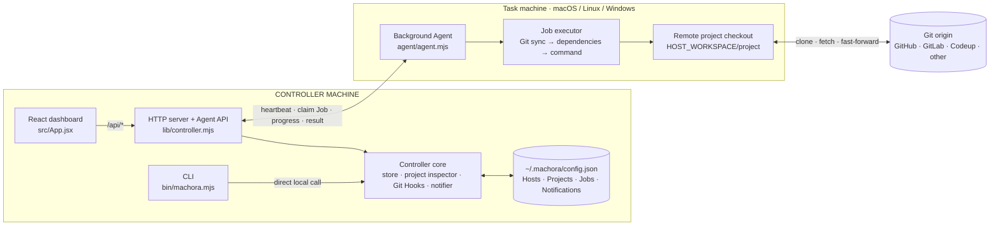
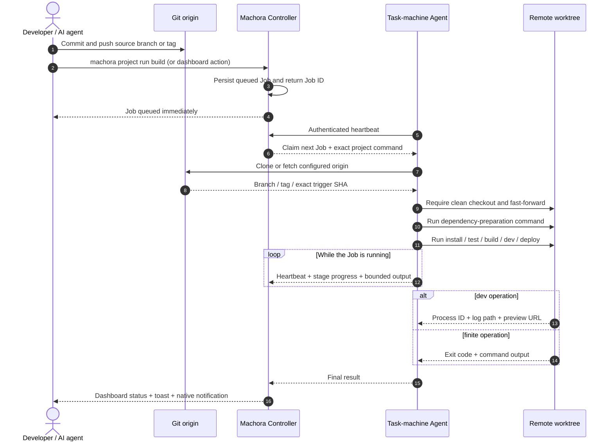

<div align="center">
  
</div>

<div align="center">
  <h1>Machora</h1>
  <p><strong>Keep the code close. Move the heavy work elsewhere.</strong></p>
  <p>
    A lightweight, self-hosted development workload orchestrator that turns spare Macs,
    Windows PCs, and Linux servers into Git-native task machines.
  </p>
  <p>
    
    
    
    
    
  </p>
</div>

> [!IMPORTANT]
> Machora is currently an early alpha intended for trusted personal LAN, VPN, or Tailscale environments. The persistent controller installer currently targets macOS; task-machine Agents support macOS, Linux, and Windows.

## Contents

- [Why Machora?](#why-machora)
- [What it provides](#what-it-provides)
- [Architecture](#architecture)
- [Quick start](#quick-start)
- [CLI reference](#cli-reference)
- [Using the dashboard](#using-the-dashboard)
- [Project detection](#project-detection)
- [Job execution details](#job-execution-details)
- [Git Hooks](#git-hooks)
- [AI coding-agent integration](#ai-coding-agent-integration)
- [Files and service locations](#files-and-service-locations)
- [Updating](#updating)
- [Troubleshooting](#troubleshooting)
- [Security model](#security-model)
- [Current limitations](#current-limitations)
- [Development and contributing](#development)

## Why Machora?

A developer may work on iOS, Flutter, Java, Node.js, and web projects in the same week. Installing every SDK and running every compiler on one machine creates familiar problems:

- local CPU and memory are consumed by dependency installation, test suites, builds, and preview servers;
- one workstation accumulates incompatible toolchains and large caches;
- spare machines sit idle while the primary machine becomes the bottleneck;
- ad-hoc SSH commands make long-running work hard to track and awkward for AI coding tools;
- traditional CI is excellent for shared validation, but often too remote and slow for interactive development.

Machora keeps source editing and Git authoring on the controller machine, while moving resource-heavy operations to assigned task machines. Jobs are asynchronous: the CLI or dashboard queues work immediately, the Agent executes it in the background, and the controller receives progress, output, exit status, notifications, and preview URLs.

## What it provides

| Capability | What it does |
| --- | --- |
| One-command enrollment | Generates a short-lived installation command for macOS, Linux, or Windows task machines. |
| Persistent Agents | Installs a current-user background service without requiring `sudo`. |
| Project detection | Detects Git metadata, frameworks, languages, package managers, scripts, and sensible project commands. |
| Git-native synchronization | Clones a missing checkout or fast-forwards a clean remote checkout from the configured origin. |
| Asynchronous Jobs | Runs sync, dependency preparation, and project commands without keeping an AI or terminal task blocked. |
| Project operations | Configurable `install`, `test`, `build`, `dev`, and `deploy` operations. |
| Dev previews | Starts a detached preview process and returns a LAN-accessible URL when possible. |
| Git push automations | Maps user-defined branch or tag patterns to user-selected project operations. |
| Host commands | Executes audited commands on a task machine, with confirmation for elevated-risk commands. |
| Machine visibility | Shows online status, CPU, memory, architecture, workspace, Agent version, and exact development-tool versions. |
| AI-aware policy | Installs a local Machora Skill and a Git-excluded `AGENTS.override.md` that route heavy operations to the task machine. |
| Notifications | Stores completion events, displays in-app toasts, and sends best-effort native controller notifications. |
| Web dashboard + CLI | Uses the same controller store, whether an action starts from the browser or terminal. |

## Architecture

### Code modules



The CLI uses controller modules directly, while the dashboard talks to the same store through the local HTTP API. The Agent is the only component installed on a task machine.

### Project Job lifecycle



The execution model deliberately keeps Git as the source of truth:

1. You edit and review source code on the controller machine.
2. You commit and push the branch or tag to the configured Git origin.
3. Machora queues a Job for the project's assigned task machine.
4. The Agent clones or fast-forwards the remote checkout, prepares dependencies, and runs the configured operation.
5. Progress and bounded output flow back through Agent heartbeats.
6. The controller stores the result and can surface an exit code, notification, or preview URL.

Local uncommitted or unpushed changes are **never copied** to a task machine.

## Core concepts

### Controller

The controller owns host registrations, project mappings, command configuration, Jobs, Git triggers, and notifications. Its HTTP server provides both the local web dashboard and the Agent API.

### Task machine

A task machine is any enrolled macOS, Linux, or Windows computer with Node.js 20 or newer. Its small, dependency-free Agent sends a heartbeat every 10 seconds and claims one Job at a time.

### Project

A project is a local Git repository associated with one task machine. Machora records its origin, branch, detected stack, remote workspace path, editable operation commands, local AI policy, and optional Git push triggers.

### Job

A Job is an asynchronous, auditable unit of work. A normal project operation follows this pipeline:

```text
Git sync  →  dependency preparation  →  configured operation
```

An `install` operation runs Git sync and the install command itself. Other operations may use the configured install command as their dependency-preparation step.

## Requirements

### Controller machine

- macOS for `machora controller install` and LaunchAgent management
- Node.js 20 or newer
- Git
- a LAN, VPN, or Tailscale address reachable by task machines

The controller can also be started manually from source on other Node.js platforms, but the formal persistent controller installer is currently macOS-only.

### Task machines

- Node.js 20 or newer
- `curl` on macOS/Linux, or PowerShell on Windows
- Git
- credentials that can clone the project's origin when it is private
- the SDKs required by the project assigned to that machine

## Quick start

### 1. Build and install the controller

```bash
git clone <repository-url> machora
cd machora
npm ci
npm run build

node bin/machora.mjs controller install \
  --advertise http://192.168.1.42:4178
```

Replace `192.168.1.42` with the controller address that task machines can reach. The installer:

- copies a self-contained runtime to `~/.machora/app`;
- stores controller data in `~/.machora/config.json`;
- installs a macOS LaunchAgent with automatic startup and crash restart;
- installs `~/.local/bin/machora` and, when safely writable, `/usr/local/bin/machora`;
- refreshes persistent Git Hook and AI-policy paths for existing projects.

No `sudo` is required.

> [!NOTE]
> Existing `rdev` installations are migrated automatically. The installer copies controller data from `~/.rdev` when `~/.machora` has no configuration, replaces the legacy controller LaunchAgent, and refreshes project Skills and Git Hooks. The deprecated `rdev` command remains as a compatibility alias. Existing task-machine Agents can continue from `.rdev-agent`; newly enrolled Agents use `.machora-agent`.

### 2. Open the dashboard

```bash
machora dashboard
```

This verifies the controller health endpoint, starts an installed but stopped controller, and opens `http://127.0.0.1:4178` in the system browser.

To verify and print the URL without opening a browser:

```bash
machora dashboard --no-open
```

### 3. Enroll a task machine

On the controller:

```bash
machora host add build-mac --os macos --workspace ~/Code
```

Machora prints a single-use installation command. Copy that command and run it on the task machine. For example, a macOS/Linux command looks like:

```bash
curl -fsSL 'http://CONTROLLER:4178/install.sh?token=…' | sh
```

For Windows, Machora prints the PowerShell equivalent:

```powershell
irm 'http://CONTROLLER:4178/install.ps1?token=…' | iex
```

The token expires after 15 minutes and can be used only once.

### 4. Assign a Git project

From the local repository on the controller:

```bash
cd ~/Code/my-project
machora project set build-mac
```

Machora will:

1. inspect the Git repository and detect its stack;
2. associate it with `build-mac`;
3. derive a remote path beneath the host workspace;
4. install the Git-excluded Machora Skill and AI policy;
5. queue the initial clone or pull Job.

### 5. Run remote operations

```bash
machora project run test
machora project run build
machora project run dev
```

Each command returns a Job ID immediately. Inspect it with:

```bash
machora job status <job-id>
machora job status <job-id> --json
```

## End-to-end example

```bash
# Controller setup
node bin/machora.mjs controller install \
  --advertise http://192.168.1.42:4178

# Generate the installer for a spare Mac
machora host add mac-mini --os macos --workspace ~/Code

# Run the printed curl command on that Mac, then verify enrollment
machora host list

# Associate a local project
cd ~/Code/randomaddress-web
machora project set mac-mini

# Inspect detected commands and the remote mapping
machora project status --json

# Queue work without blocking this terminal
machora project run test
machora project run build

# Inspect recent work or open the web console
machora job list
machora dashboard
```

## CLI reference

Run `machora --help` for the compact command list and `machora --version` for the installed version.

### Dashboard

```text
machora dashboard [--no-open]
machora console [--no-open]
```

| Option | Description |
| --- | --- |
| `--no-open` | Check controller health and print the dashboard URL without opening a browser. |

`console` is an alias for `dashboard`.

### Controller lifecycle

```text
machora controller install [options]
machora controller status
machora controller start
machora controller stop
machora controller restart
```

`controller install` options:

| Option | Default | Description |
| --- | --- | --- |
| `--port <port>` | `4178` | Controller HTTP port. |
| `--host <address>` | `0.0.0.0` | Interface address on which the controller listens. |
| `--advertise <url>` | auto-detected LAN URL | URL embedded in task-machine installation and update commands. |
| `--migrate-from <path>` | `MACHORA_CONFIG_DIR`, legacy `RDEV_CONFIG_DIR`, or `~/.rdev` | Copy an existing `config.json` and Hook logs into `~/.machora`. The source is not deleted. |
| `--force` | off | Replace a conflicting destination configuration and permit replacement of a conflicting global CLI wrapper. Use carefully. |

Examples:

```bash
machora controller status
machora controller restart

node bin/machora.mjs controller install \
  --migrate-from /tmp/machora-preview \
  --advertise http://100.64.0.10:4178
```

### Development server

```text
machora server [--port <port>] [--host <address>] [--advertise <url>]
```

| Option | Default | Description |
| --- | --- | --- |
| `--port <port>` | `4178` | HTTP port. |
| `--host <address>` | `0.0.0.0` | Listen address. |
| `--advertise <url>` | auto-detected LAN URL | Public controller origin given to task machines. |

`serve` and `ui` are aliases for `server`. This foreground mode is useful while developing Machora itself; use `controller install` for the persistent macOS service.

### Hosts

```text
machora host add <alias> [options]
machora host list
machora host remove <alias>
```

`host add` options:

| Option | Default | Description |
| --- | --- | --- |
| `--os <auto|macos|linux|windows>` | `auto` | Determines the generated installation command and default workspace syntax. |
| `--workspace <path>` | `~/Code` or `%USERPROFILE%\Code` | Root directory for remote project checkouts. |
| `--controller <url>` | detected LAN URL | Override the controller URL placed in the enrollment command. |
| `--port <port>` | `4178` | Port used when deriving the enrollment URL. |
| `--address <host-or-ip>` | none | Create a pending inventory record before Agent enrollment. |
| `--capabilities <a,b>` | none | Comma-separated capabilities for a manually registered host. |

Aliases must be 2–40 lowercase letters, numbers, dots, dashes, or underscores. A host created with `--address` remains pending until an Agent enrolls under the same alias.

Examples:

```bash
machora host add ios-builder --os macos --workspace ~/Code
machora host add windows-packager --os windows --workspace '%USERPROFILE%\Code'
machora host add ubuntu-ci --os linux --controller http://100.64.0.10:4178
machora host list
machora host remove ubuntu-ci
```

### Projects

```text
machora project set <host> [--path <path>]
machora project assign <path> --host <host>
machora project list
machora project status [--path <path>] [--json]
machora project sync [--path <path>]
machora project run <operation> [--path <path>]
machora project policy [--path <path>]
machora project remove [<id|name|path>]
```

| Command/option | Description |
| --- | --- |
| `set <host>` | Associate the current repository, or `--path`, with a host alias, address, hostname, or ID. |
| `assign <path> --host <host>` | Explicit-path form of `project set`. |
| `status --json` | Return full machine, command, Skill, Hook, trigger, and Job-count metadata as JSON. |
| `sync` | Queue a Git clone/fast-forward Job only. |
| `run <operation>` | Queue one of `install`, `test`, `build`, `dev`, or `deploy`. |
| `policy` | Refresh `.agents/skills/machora/SKILL.md`, `AGENTS.override.md`, and persistent Hook paths. |
| `remove` | Remove the controller association and its Job history. It does not delete the local or remote checkout. |
| `--path <path>` | Target repository; defaults to the current working directory where supported. |
| `--json` | Emit machine-readable JSON for `status`. |

Examples:

```bash
machora project set mac-mini
machora project set ubuntu-build --path ~/Code/api
machora project assign ~/Code/ios-app --host ios-builder
machora project sync --path ~/Code/api
machora project run build --path ~/Code/api
machora project policy --path ~/Code/api
```

### Git Hooks

```text
machora hooks install [--path <path>]
```

Installs or refreshes Machora's managed `pre-push` Hook. If a Hook already exists, Machora preserves it as `pre-push.machora-original` and invokes it before scheduling its own background confirmation.

Git trigger rules themselves are configured in the project's dashboard. A rule contains:

- an event: `branch-push` or `tag-push`;
- a glob-like pattern such as `main`, `release/*`, or `v*`;
- any configured project operation selected by the user;
- an enabled/disabled state.

Machora waits until the pushed remote ref resolves to the exact local SHA before queuing the Job. A branch or tag name never maps to a hard-coded operation.

### Jobs

```text
machora job list [--status <status>] [--json]
machora job status <job-id> [--json]
```

Supported status filters are `queued`, `running`, `succeeded`, and `failed`. The JSON form includes pipeline steps, timestamps, output, error, result metadata, trigger context, project, and host.

Examples:

```bash
machora job list
machora job list --status running
machora job list --json
machora job status 3a601f3e-… --json
```

## Using the dashboard

The dashboard exposes workflows that are intentionally richer than the compact CLI:

### Machines

- create enrollment commands;
- see online/offline state and heartbeat recency;
- inspect CPU, memory, address, architecture, workspace, and Agent version;
- expand the exact detected development-tool versions;
- see the number of active Jobs;
- open **Run command** from a host row's overflow menu.

### Projects

- select a local Git folder with a native folder picker or manual path;
- assign it to a task machine;
- review detected framework, language, package manager, and remote path;
- edit and save `install`, `test`, `build`, `dev`, and `deploy` commands;
- run an operation or standalone Git sync;
- configure branch/tag push triggers;
- inspect local Skill and remote readiness.

### Jobs

- filter active, failed, and completed Jobs;
- inspect pipeline stages and current progress;
- see bounded output, errors, exit codes, and duration;
- open a returned dev-preview URL;
- review both project Jobs and direct host commands in one history.

## Project detection

Machora currently detects and proposes commands for:

| Project type | Detection | Typical commands |
| --- | --- | --- |
| Next.js / Vite / React / Node.js | `package.json`, dependencies, scripts, lockfiles | npm, pnpm, Yarn, or Bun install/test/build/dev scripts |
| Flutter | `pubspec.yaml` | `flutter pub get`, `flutter test`, web-server preview |
| Java / Maven | `pom.xml` | dependency download, test, package |
| Java / Gradle | `build.gradle` or `build.gradle.kts` | wrapper dependencies, test, build |
| Swift | `Package.swift` | resolve, test, release build |
| Go | `go.mod` | module download, test, build |
| Rust | `Cargo.toml` | fetch, test, release build |
| Generic Git | Git repository | commands remain empty until configured |

All detected commands are editable controller configuration. Saving a command does not execute it.

For Node.js projects, lockfiles influence the install command. For example, npm uses `npm ci` when `package-lock.json` exists, while pnpm uses `pnpm install --frozen-lockfile` when a pnpm lockfile exists.

## Job execution details

### Safe Git synchronization

The Agent:

- clones the configured origin when the remote checkout is missing;
- requires the existing checkout to match the configured origin;
- refuses to overwrite a dirty task-machine checkout;
- fetches and fast-forwards instead of rewriting history;
- accepts a new SSH host key non-interactively;
- still requires valid SSH keys or HTTPS credentials for private repositories.

### Dependency preparation

Project operations automatically use the project's configured install command as a preparation stage, except when the selected operation is `install` itself. Flutter projects may also run CocoaPods preparation for an iOS Podfile on macOS. Maven, Gradle, SwiftPM, Go, and Cargo use their detected dependency commands.

### Dev previews

A `dev` Job starts a detached process on the task machine. Machora applies package-manager-aware argument forwarding, chooses the detected/default project port, binds the preview to `0.0.0.0` where supported, and returns a URL based on the task-machine address. The result also stores the process ID and initial log path.

Preview stop/restart controls and continuous log streaming are not implemented yet.

## Direct host commands

Use the host row's overflow menu in the dashboard to run an audited command directly in the host workspace. A host-command Job skips Git synchronization and dependency preparation.

Machora asks for a second confirmation when a command appears to:

- request elevated privileges;
- recursively delete files;
- alter disks or stop the machine;
- install shared/global development tooling;
- download and immediately execute remote code.

This classification is a guardrail, not a security sandbox. An enrolled Agent can execute commands with the current task-machine user's permissions.

## AI coding-agent integration

When a project is assigned, Machora writes:

```text
.agents/skills/machora/SKILL.md
AGENTS.override.md
```

Both paths are added to the repository-local `.git/info/exclude`, so they do not appear in normal Git status or commits.

The Skill teaches compatible AI coding agents how to inspect the Machora association and queue asynchronous work. `AGENTS.override.md` preserves the project's shared root `AGENTS.md` instructions and adds a controller-local policy that:

- prevents automatic local dependency installation, tests, builds, packaging, deployment, and preview servers;
- routes explicitly requested heavy operations through `machora project run`;
- forbids silently falling back to local execution when a remote Job fails;
- keeps code editing, review, and Git authoring on the controller.

Refresh these files after updating Machora:

```bash
machora project policy --path .
```

The policy guides compatible AI agents; it is not an operating-system sandbox.

## Development environment discovery

The Agent reports exact versions for installed tools, including:

- Node.js, npm, pnpm, Yarn, and Bun;
- Git;
- Java, JDK, Maven, Gradle, and Kotlin;
- Python;
- Go;
- Rust and Cargo;
- Ruby and PHP;
- .NET SDK;
- Swift, Xcode, and Clang;
- Docker.

At Agent startup, Machora merges the persistent service environment with the user's login-shell environment, npm global binary directory, `PNPM_HOME`, and common developer-tool directories. The same deterministic environment is used for discovery, Git, dependencies, host commands, project operations, and detached previews.

## Files and service locations

### Controller

| Path | Purpose |
| --- | --- |
| `~/.machora/config.json` | Hosts, projects, Jobs, notifications, and enrollment data. |
| `~/.machora/controller.json` | Installed controller port, host, and advertised URL. |
| `~/.machora/app/` | Self-contained installed controller runtime. |
| `~/.machora/logs/controller.log` | Controller standard output. |
| `~/.machora/logs/controller-error.log` | Controller errors. |
| `~/.machora/hooks/` | Background Git Hook confirmation logs. |
| `~/Library/LaunchAgents/dev.machora.controller.plist` | macOS controller LaunchAgent. |
| `~/.local/bin/machora` | User-local CLI wrapper. |
| `/usr/local/bin/machora` | Global wrapper when safely writable. |

### Task-machine Agent

| Platform | Runtime/config | Service |
| --- | --- | --- |
| macOS | `~/.machora-agent/` | `~/Library/LaunchAgents/dev.machora.agent.plist` |
| Linux | `~/.machora-agent/` | `~/.config/systemd/user/machora-agent.service`, with `nohup` fallback |
| Windows | `%LOCALAPPDATA%\machora-agent\` | Current-user Startup command |

## Environment variables

| Variable | Purpose |
| --- | --- |
| `MACHORA_CONFIG_DIR` | Override the controller data directory. Useful for tests or isolated instances. |
| `MACHORA_AGENT_DIR` | Override the task-machine Agent directory. |
| `MACHORA_SKIP_SERVICE=1` | Install/enroll an Agent without registering a persistent background service; runs one heartbeat cycle instead. |

## Updating

### Controller

From the source checkout:

```bash
git pull
npm ci
npm run build
node bin/machora.mjs controller install \
  --advertise http://CONTROLLER:4178
```

Reinstalling refreshes the runtime and restarts the LaunchAgent while retaining `~/.machora/config.json`.

### Agent

The dashboard shows an update command when an Agent is older than the controller's supported Agent version.

macOS/Linux:

```bash
curl -fsSL 'http://CONTROLLER:4178/update.sh' | sh
```

Windows:

```powershell
irm 'http://CONTROLLER:4178/update.ps1' | iex
```

The updater preserves the Agent credentials and workspace, replaces only `agent.mjs`, and restarts the current-user process or service.

## Troubleshooting

### Another machine cannot reach the installer

- Do not use `127.0.0.1` in a command run on another machine.
- Reinstall or start the controller with a reachable `--advertise` URL.
- Confirm the controller is listening on `0.0.0.0`, not only loopback.
- Check the controller firewall and whether port `4178` is reachable over the LAN/VPN.
- Verify locally with `machora dashboard --no-open` and remotely with `curl http://CONTROLLER:4178/api/health`.

### A task machine is offline

- Confirm Node.js 20+ is still installed at the path captured by the service.
- Inspect `~/.machora-agent/agent-error.log` on macOS/Linux or the Agent log on Windows.
- Check that the task machine can reach the controller URL stored in its Agent `config.json`.
- Restart the platform service or run the Agent update command.

A host is shown as offline after 45 seconds without a heartbeat.

### A command exists in Terminal but the Agent cannot find it

- Inspect the Environment section in the host row.
- Ensure the tool is available from the user's login shell or a standard global-tool directory.
- If the tool was just installed into an unusual path, update the login-shell configuration and restart the Agent service.

### Git sync fails

- Confirm the project has an `origin` remote.
- Push the branch; local uncommitted and unpushed changes are not transferred.
- Configure SSH keys or HTTPS credentials on the task machine for private repositories.
- Clean or intentionally reconcile a dirty task-machine checkout; Machora will not overwrite it.

### A saved project command did not run

Saving commands only updates controller configuration. Click the operation's Run button or use:

```bash
machora project run <operation> --path .
```

### Inspect controller health and logs

```bash
machora controller status
machora dashboard --no-open
tail -f ~/.machora/logs/controller.log
tail -f ~/.machora/logs/controller-error.log
```

## Security model

- The default server uses plain HTTP. Use Machora only on a trusted LAN/VPN or place it behind an HTTPS reverse proxy.
- Enrollment tokens are random, single-use, and expire after 15 minutes.
- Agent secrets are stored in the Agent profile and hashed in the controller store.
- Project mutation APIs are restricted to loopback requests from the controller machine.
- The Agent runs with the current user's permissions and can execute configured commands.
- Remote-command risk detection is advisory and cannot replace operating-system isolation.
- Do not expose the controller directly to the public internet in the current alpha release.

## Current limitations

- The persistent controller installer supports macOS only.
- The controller uses a local JSON store rather than a multi-user database.
- There is no user authentication or role model for the dashboard.
- One task machine claims one Job at a time.
- Local uncommitted files are not synchronized; Git is intentionally the only source transport.
- Job cancellation and retention controls are not implemented.
- Build artifacts are not downloadable from the controller yet.
- Dev-preview stop/restart controls and continuous log streaming are not implemented.
- The default network transport is HTTP.

## Roadmap

- managed preview stop, restart, status, and live log streaming;
- downloadable build artifacts and retention policies;
- Job cancellation and concurrency controls;
- richer disk and GPU telemetry;
- deployment adapters;
- persistent controller installers for Linux and Windows;
- optional authenticated HTTPS and multi-user access.

## Development

```bash
npm ci
npm run dev
```

The Vite UI lives in `src/`; the Node controller and APIs live in `lib/` and `server/`; the dependency-free task-machine runtime lives in `agent/agent.mjs`.

Before opening a contribution:

```bash
npm test
npm run build
npm run test:sites
```

The build must produce:

```text
dist/client/index.html
dist/server/index.js
dist/.openai/hosting.json
```

## Contributing

Issues, focused bug reports, platform compatibility notes, and small pull requests are welcome. For behavior changes, include tests and describe which controller/Agent operating systems were exercised.

Please keep these design principles intact:

- Git remains the source of truth;
- project commands run only after an explicit request or configured Git trigger;
- task-machine checkouts are never force-reset over dirty work;
- existing Git Hooks are preserved;
- dangerous host commands require confirmation;
- generated AI policy files remain local and out of Git.

## License

Machora is licensed under the [Apache License 2.0](./LICENSE). You may use, modify, and distribute it, including for commercial purposes, subject to the license terms.

---

<div align="center">
  <sub>Built for developers with more machines than patience for local build fans.</sub>
</div>
